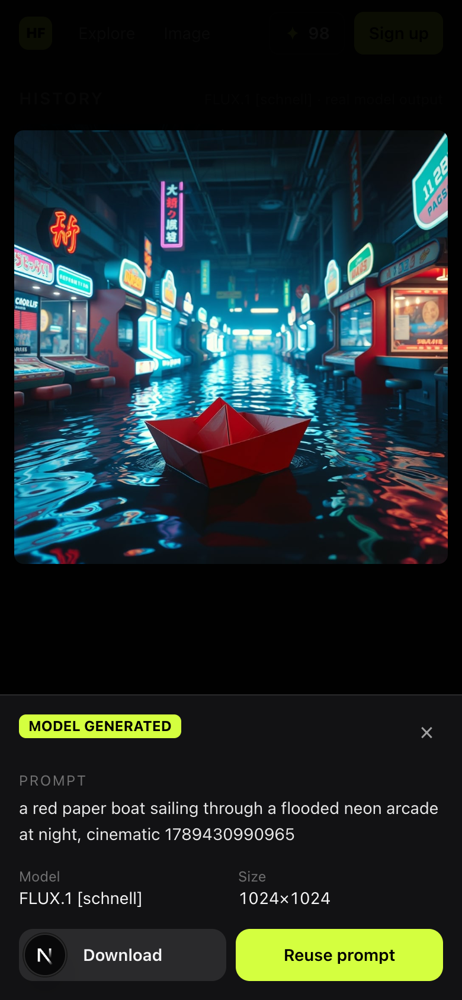
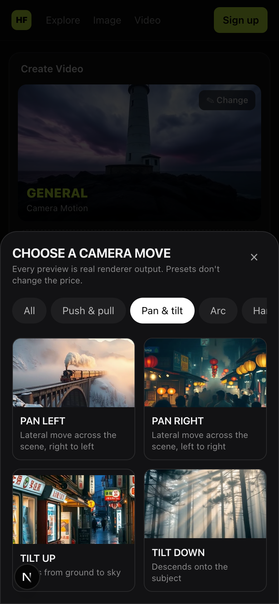

# Higgsfield clone

A working rebuild of [higgsfield.ai](https://higgsfield.ai)'s core loop, made as a hiring assignment: open the site, make an image, turn it into a directed camera move, see every credit it cost, and hit a paywall that tells the truth.

**Live:** https://higgsfield-ai-clone.vercel.app

**Try it in 30 seconds:**
1. Open `/ai/image`, type a prompt, and press **Generate**. You don't need to sign up: a guest session with 100 credits is created on the spot.
2. In the lightbox, press **Animate**, pick a camera preset, and press **Generate** again.
3. To see the paywall, open **Get more credits**. The checkout is a labelled demo with a prefilled test card, and promo code **`AHSAN345`** takes 100% off. No payment is processed. See [Payments](#payments-there-are-none).

An independent rebuild, not affiliated with or endorsed by Higgsfield Inc.

| Explore | Image studio | Video studio (presets) |
|---|---|---|
|  |  |  |

---

## What's real, what's rendered, what's labelled

Standing rule for the whole build: **a real transform, or a label. Never imply a model generated something it didn't.** Every asset carries a `source` column (`generated`, `rendered`, `sample`), and the UI badges it from that column, not from copy.

| What you see | What it actually is | How it's labelled |
|---|---|---|
| Images | **Genuinely generated** by **FLUX.1 [schnell]** on Cloudflare Workers AI, from your prompt, at request time. | `MODEL GENERATED` |
| Non-square images | FLUX.1 schnell only outputs 1024×1024, so 16:9, 9:16, 4:3 and 3:4 are a centre crop of that output. | "Centre-cropped to 16:9" |
| Videos | A **real camera move rendered by ffmpeg** over a real still, frame by frame, into an MP4. **Not diffusion, not AI-generated video.** | `RENDERED CAMERA MOVE`: "Not AI-generated video" |
| Pre-rendered example (video) | A clip from a library rendered ahead of time. It's the same preset and aspect, but over a library image, not yours. Served when live rendering is capped (below). **Never charged.** | Amber `PRE-RENDERED EXAMPLE`, with the reason and "No credits were charged" |
| Sample (image) | If the image provider's free quota or rate limit is hit, the job fails and is refunded, and library images are shown instead. | Amber `SAMPLE, NOT YOUR PROMPT` |
| Example assets | Six seed images copied into a new account so Assets isn't empty. | `Example` |
| Plans and checkout | A demo: no payment processor exists. | "Demo checkout, no real payment" |

### Why video is a camera move, not diffusion

The reference product sells **direction**: "250+ presets for camera control", ADD IMAGE → CHOOSE PRESET → GET VIDEO. No free image-to-video diffusion API could run inside this budget: they're paid, slow, rate-limited, and unpredictable in latency. Returning someone else's clip and calling it generated would break the standing rule.

What *can* be real is the direction itself. `src/lib/render/camera.ts` renders 14 presets as real ffmpeg filter graphs over the user's still:
- push-in, crash zoom, pull-out, pan, tilt
- arc (a 2D pan plus roll, rendered oversize so rotation never shows corners; labelled "2D arc, not a true orbit")
- handheld drift (summed sines)
- rack focus (a blurred layer faded over the sharp frame)

The output is an honest MP4 you can download, and the preset system is the product.

---

## The free-tier compute limit, and what it forced

This runs on **Vercel Hobby**. Every live render is real CPU inside a Vercel Function. During the build, the renders exhausted the Hobby **Fluid Active CPU** allowance (6h 51m used of 4h), and from then on **new deployments failed** with "Resource provisioning failed".

The decision was to stay on Hobby, make rendering cheaper, and put a hard ceiling on it that can be pulled without a deploy (`fix/render-cpu-budget`, PR #16).

1. **The renderer is ~52% cheaper.** I dropped an internal 2× upscale that ffmpeg was repeating for no visible gain, and switched x264 to `superfast`/CRF 23. Push-in went from 1.66 to 0.80 CPU-seconds per render (measured locally; Vercel ran about 4.8× slower). The trade-off is ~3× larger files: Blob transfer is spent to save CPU.
2. **Live renders are 720p / 5s only.** This was set in the database's model capabilities, so it applied to production immediately, even before a deploy could land.
3. **Live renders are capped per account:** 1 for a guest, 3 for a registered account. The check runs inside the job's transaction with the user row locked, so two quick clicks can't both win.
4. **The two outlier moves are pre-render-only.** Arcs and rack focus cost about 2× the others.
5. **A pre-rendered library covers the rest.** All 14 presets × 3 aspects (42 clips, rendered on a laptop, not on Vercel) were uploaded ahead of time. Past the cap, the job completes instantly with the matching clip.
   - **Cost 0, no ledger row at all.**
   - Labelled on the tile, in the lightbox, and **before you press the button**: it reads "Get example · Free", with the reason underneath.
6. **Kill switch, no deploy.** `npx tsx --conditions react-server scripts/ops/render-mode.ts prerendered` (or one SQL insert into `system_events`) switches every video request to pre-rendered examples within ~10 seconds. `VIDEO_RENDER_MODE=prerendered` forces it at deploy time too.

Measured CPU-seconds per 720p/5s render (local, user+sys; `scripts/dev/measure-render-cpu.ts`):

| preset | CPU-s | preset | CPU-s |
|---|---|---|---|
| general | 0.79 | handheld | 0.80 |
| slow push-in | 0.80 | handheld push | 0.84 |
| crash zoom | 0.84 | pan left / right | 0.73 / 0.74 |
| pull-out reveal | 0.84 | tilt up / down | 0.76 / 0.77 |
| **arc pan left / right** | **1.61 / 1.58** | **rack focus in / out** | **1.29 / 1.30** |

Rule behind all of it: **never charge for a generation we didn't produce.**

---

## What was built first, and why

The build order followed the risk and the core loop. Each step became usable before the next started:

1. **Deploy pipeline, schema, auth with guest sessions.** A reviewer must reach a working studio with zero signup friction, and the recon's onboarding quiz and modal chain were the opposite of that.
2. **Credit ledger, then the async job pipeline.** Price on the button before commit, charge exactly once, refund exactly once. These are the parts that are expensive to get wrong later.
3. **Image generation (the checkpoint):** a stranger types a prompt and gets a real image on production.
4. **Video render and presets.** Presets are the reference's differentiator, and ffmpeg was the biggest technical unknown. Rendering was verified on Vercel before any UI was built on top of it.
5. **Assets, then Explore.** The recon says "nothing is ever empty", so the landing page is dense with real generated media (68 seed images, 14 real preset renders), and all ~90 links go somewhere real.
6. **Paywall, checkout, skeletons, mobile pass.**

## Cut list, with reasoning

| Cut | Why |
|---|---|
| **Soul ID / character consistency** | It needs identity-conditioned generation (reference images or per-user fine-tunes). FLUX.1 schnell on Workers AI is text-to-image only and takes no image input. The only way to "ship" it would have been reusing earlier images and calling the result consistent: a feature claim the model didn't earn. The flow was also never observed in the recon, so its UX would have been invented. It's the most visible cut, and deliberately so. |
| Diffusion image-to-video | No free, fast, reliable API. Replaced by real rendered camera moves, labelled as such. |
| True orbit and dolly zoom | They need depth. Arcs ship as a labelled 2D arc. |
| Audio, image edit tools (inpaint, relight, upscale, swaps) | Separate tool UIs that were never observed; each would be a shallow shell. |
| Studios, Canvas, Supercomputer, MCP page | Other products. Their banners were replaced with this build's own true features rather than shown as claims. |
| Onboarding quiz, post-signup modal chain, countdown discounts | Friction and pressure tactics between the user and their first generation. |
| Real payments, Teams, SSO, unlimited tiers | See [Payments](#payments-there-are-none). |
| OAuth, password reset, email verification | These need email delivery; email and password plus claimable guest accounts cover the loop. |
| Upload from device | ADD IMAGE uses your generations plus the library. That keeps the 1,500-upload Blob cap meaningful and avoids moderating arbitrary uploads. |
| Edit Video / Motion Control / Extend / reference and sound tabs | They would have been dead tabs. |
| Community posts and likes | There are no other users. |
| FLUX.2 [klein] | Tested live: 14s latency and a false moderation flag on a harmless prompt. It's kept in the catalogue as inactive. |
| Credit slider on plan cards, model gating by plan | No gated model is active, so gating would gate nothing. |

## Assumptions filling the recon's §5 gaps

The recon (`recon/notes.md` §5) lists what was never captured. Each gap was filled with an explicit assumption:

| Gap | Assumption made |
|---|---|
| **A completed generation** (queue, progress, timing, pending card) | An async job: `queued → processing → succeeded / failed / canceled`. A pending card sits in History at the job's aspect ratio, with a real progress bar and Cancel. Polling runs only while something is active, and a stale-job sweep fails and refunds anything stuck. |
| **The result view** | A lightbox with the honest label, prompt, model, size, **Download**, **Animate** (image → video studio), **Reuse** (prompt → composer) and **Delete**. No share, no variations. |
| **Assets / library** | One grid of everything you made, newest first, filterable by type, with examples badged. Delete is a confirmed soft delete. Pre-rendered examples and samples stay in History, never in Assets. |
| **Header credit balance** | A chip with the credit glyph and the number, linking to `/credits`: the balance translated into outcomes ("= 50 images or 3 videos") plus the full ledger. |
| **Error and failure states** | A failure card gives the reason, "+N refunded" and **Retry · N**. Quota or rate limits show labelled samples. A 402 opens the recon's "Upgrade plan to buy credits" modal with the real shortfall ("costs 2 credits and you have 1"). There's a branded 404 and an error page with Try again. |
| **The preset gallery** (Change / View all presets never clicked) | A modal grid of all 14 presets, each preview a **real render of that preset**. "Change" opens it, and `/ai/video?gallery=1` deep-links it. |
| **Mobile** (desktop only in the recon) | Mobile-first at 390px:<ul><li>the header drops Explore and Pricing, since the logo goes home</li><li>the composer docks to the bottom with a safe area</li><li>modals become bottom sheets</li><li>no horizontal overflow, tap targets ≥ 32px, controls ≥ 16px text (no iOS zoom)</li></ul>Audited by `scripts/dev/mobile-audit.mjs`. |
| **Returning sign-in and sign-out** | Email and password sign-in and sign-out in the header. Signing up from a guest session **claims** it, so the guest's images, videos and credits carry over. |

Other gaps filled the same way:
- **Plan prices:** Basic $9, Pro $29 ($20/mo annual), Max $79 ($45/mo annual). Monthly credits are 120 / 600 / 1,800, shown translated into outcomes.
- **Credit prices:** 2 credits per image (list price 2.5, shown struck through, as observed) and 30 credits per 5s 720p video.
- **Guests start with 100 credits.**

## Postgres guarantees

The money-like parts are enforced by the database, not by application convention:

- **Balance floor.** `CHECK (credit_balance_tenths >= 0)` on users and `CHECK (balance_after_tenths >= 0)` on ledger rows. A charge is a conditional `UPDATE … WHERE balance >= cost`, so two submits racing for the last credits can't both pass, and the `CHECK` backs that up. Credits are integer tenths, so there's no float drift.
- **One charge, one refund per job.** A partial unique index on `credit_ledger (job_id, reason) WHERE job_id IS NOT NULL`:
  - A job can have at most one `generation_charge` and one `generation_refund`.
  - Refunds use `INSERT … ON CONFLICT DO NOTHING`, and the balance moves only if the row went in. The worker, a user's Cancel and the stale-job sweep can all refund at the same moment and exactly one wins.
  - Job status changes are guarded (`UPDATE … WHERE status IN (…)`), so a finished job can't be failed afterwards.
  - The ledger always sums to the balance; every verify script asserts this.
- **The 1,500-upload cap.** Vercel Blob on Hobby includes 2,000 uploads a month and locks the store for 30 days past that.
  - Every upload first increments `blob_usage`, which has `CHECK (puts BETWEEN 0 AND 1500)`, so the hard stop can't be bypassed by any code path.
  - All Blob access goes through one module (`src/lib/storage.ts`), and ESLint forbids importing `@vercel/blob` anywhere else.
  - Hitting the cap is logged once per month to `system_events`, and the job fails with "New uploads are paused for this month. Your credits were refunded."
- **Plan credits once per plan.** Grants happen under a `SELECT … FOR UPDATE` on the user row and check for an earlier grant for that plan, so Pro → Basic → Pro can't mint credits, even with the promo code or concurrent submits.

## Where the first answer was wrong

These are the places where the first approach was wrong, and how each was corrected:

- **Turbopack couldn't bundle ffmpeg.** `@ffmpeg-installer/ffmpeg` picks its platform binary with a dynamic `require`. The first build of the render route failed with five "Module not found: Can't resolve … @ffmpeg-installer/darwin-arm64/package.json" errors, because Turbopack tried to bundle every platform variant. Fixed by marking it `serverExternalPackages` and tracing the binary into `/api/**` with `outputFileTracingIncludes`. A real render was then verified on Vercel before any UI was built on it.
- **Arc pan showed black corners.** Rotating a frame the size of the output exposes its corners mid-roll. Fixed by rendering 10% oversize, rotating, then cropping back to the output size.
- **Rack focus was 4–7× slower than the other moves.** A per-pixel `blend` expression was replaced by a blurred layer with an alpha fade and overlay: 58s → 23s for 10s at 1080p on Vercel.
- **The credit-minting loop.** The first demo plan switch granted a plan's credits every time you switched to it, so Pro → Basic → Pro minted 600 credits per round. Fixed with once-per-plan grants under a row lock; the concurrency case is tested.
- **The guest limit was too low for a shared office IP.** The first limit was 5 guest sessions per IP per hour. It tripped on my own test runs, and it would have tripped on reviewers behind one office NAT. Raised to 30 and made configurable (`GUEST_LIMIT_PER_HOUR`).
- **The `public` output-folder misconfiguration.** The Vercel project was imported with the "Other" framework preset, so builds succeeded and then failed looking for a `public` output directory. Fixed by pinning the framework in `vercel.json`.
- **Compute budget.** The first render settings (1080p, 10s, `veryfast`, 2× internal upscale, unlimited live renders) ran through the Hobby CPU allowance. See [the free-tier compute limit](#the-free-tier-compute-limit-and-what-it-forced).
- **Smaller corrections:**
  - A completed render overwrote the job's `provider_state` and erased the `served=live` marker, so completed renders stopped counting toward the cap. The UI e2e caught it; the state is now merged.
  - The Blob store was private, so public uploads failed. Fixed with private uploads behind a `/media` route with HTTP Range, which iOS Safari needs for video.
  - Cloudflare's docs list a `seed` parameter that the API rejects.
  - `next/font/google` broke offline builds.
  - The header clipped at 390px as nav items were added.
  - Tests passed while screenshots showed empty tiles; image-decode assertions were added.
  - The lightbox image was 0×0 before loading, so it had no skeleton.

## Payments: there are none

**No real payment processing exists in this build.**
- The checkout form (card number, expiry, CVC, name) is validated for format in the browser and discarded.
- The card inputs have no `name`, are never sent in any request, and are never stored. The paywall e2e records every request the page makes and fails if any contains card details.
- Only the plan id and the promo code reach the server.
- Completing checkout switches the plan and grants that plan's monthly credits once, as a `demo_topup` ledger row noted "no payment taken".
- Promo code `AHSAN345` (case-insensitive) takes 100% off. Any other code is refused.

---

## Stack

- **Next.js 16** (App Router, Turbopack), TypeScript, Tailwind CSS v4, on **Vercel Hobby** (Fluid compute, 300s functions)
- **Neon Postgres** with Drizzle ORM: migrations in `drizzle/`, schema in `src/db/schema.ts`
- **Vercel Blob** (private store) behind `/media/[...path]`
- **Cloudflare Workers AI**: FLUX.1 [schnell]
- **ffmpeg** (`@ffmpeg-installer/ffmpeg`) and **sharp** inside Vercel Functions
- Auth: scrypt password hashes plus an HS256 session cookie (`jose`); guest sessions are real rows that can be claimed on signup

## Map of the code

| Path | What |
|---|---|
| `src/app/` | Routes: `/` (Explore), `/ai/image`, `/ai/video`, `/assets`, `/credits`, `/pricing`, `/login`, `/signup`, `/api/*`, `/media/*` |
| `src/lib/jobs/` | Job pipeline: submit (price, charge, insert in one transaction), run via `after()`, fail/cancel/retry/refund, stale sweep; video jobs |
| `src/lib/render/` | `camera.ts` (ffmpeg presets), `budget.ts` (deadline guard: fail and refund before the function limit), `policy.ts` (live caps, kill switch) |
| `src/lib/credits/` | `pricing.ts` (shared by UI and server), `ledger.ts` (charge, grant, refund) |
| `src/lib/billing/` | Plans with outcome translations, demo checkout, promo codes |
| `src/lib/storage.ts` | The only Blob importer; upload reservation against the cap |
| `src/components/` | Studios, history grid, lightbox, preset gallery, Explore sections, paywall and checkout, skeleton media |

## Running locally

```bash
npm install
```

```bash
vercel env pull .env.local
```

```bash
npx drizzle-kit migrate && npm run db:seed
```

```bash
npm run dev
```

Variable names are listed in `.env.example`: `DATABASE_URL`, `DATABASE_URL_UNPOOLED`, `CLOUDFLARE_ACCOUNT_ID`, `CLOUDFLARE_API_TOKEN`, `AUTH_SECRET`, `BLOB_READ_WRITE_TOKEN` locally, and optionally `GUEST_LIMIT_PER_HOUR` and `VIDEO_RENDER_MODE`. Values live in `.env.local` (gitignored) and in Vercel.

Seed content: `scripts/seed-library.ts` (68 images), `scripts/seed-preset-previews.ts` (14 preset renders), `scripts/seed-render-library.ts` (42 pre-rendered fallback clips).

## Verification

Checks run against the real services, and clean up after themselves:

- `npx tsx --conditions react-server scripts/verify-{auth,ledger,jobs,video,plans}.ts`: auth, the ledger (races, exactly-once refunds), job transitions, the render policy and kill switch, and the plan/promo guards.
- `node scripts/dev/ui-{image,video,assets,explore,paywall,skeletons}-e2e.mjs <baseUrl> [screenshotDir] [--mobile]`: headless Chrome as a stranger, at 390px and 1440px.
- `node scripts/dev/mobile-audit.mjs <baseUrl> <dir>`: every surface at 390px.

## How it was built

- One branch per chunk and a PR for each (what / why this, now / deliberately not in this PR / verify / mobile and desktop screenshots), merged with a merge commit; squash merge is disabled.
- `STATUS.md` was rewritten at the end of every branch.
- Every prompt and final response of the AI-assisted build is captured by hooks into [`.agent-logs/`](.agent-logs) and committed alongside the code.
