# Docket

**Make an image, then move the camera over it. Every run stays on the record.**

Docket makes an image from your prompt with FLUX.1 [schnell], then renders a real camera move over it with ffmpeg: a push-in, a pan, an arc, a rack focus, 14 in all. Everything you make lands in your log with its receipt: the model that ran, what it cost, how long it took, and any refund. The log is the library and the ledger at once.

**Live:** https://higgsfield-ai-clone.vercel.app
(The deployment keeps the name from the first brief, when this was a clone. See [History](#history-from-a-clone-to-docket).)

**Start here:** [What I changed from Higgsfield, and why](#what-i-changed-from-higgsfield-and-why). It lists what I kept, changed and cut from the reference, with the capture for each.

| Home | A camera move, compared against its still | A run's permanent record |
|---|---|---|
| 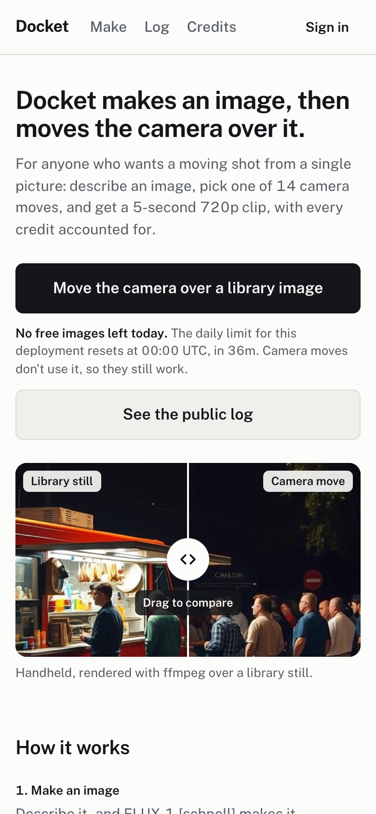 | 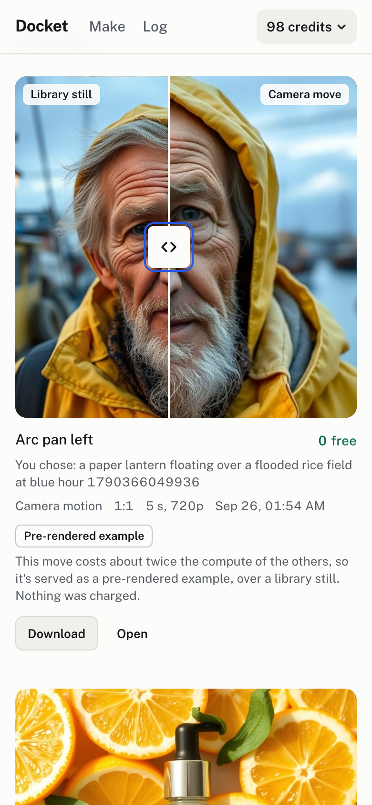 | 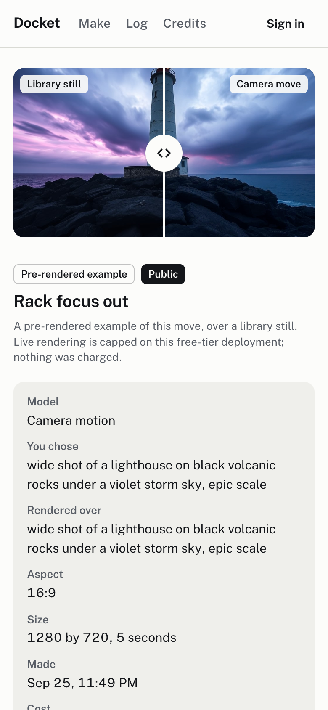 |

---

## What to click first

1. **Open the site and read home, top to bottom.** It's short, and it explains Docket rather than selling it.
   - The pair at the top is a real camera move over the library still it was rendered over: drag the handle, or use the arrow keys, to compare them.
   - **How it works** is one real published run, shown as its still, its move and its receipt line. **See a real run's record** opens that run's permanent page.
   - **Free to start** gives the starter credits, the prices and the daily limits, read from the same values the server enforces.
2. **Press Start making, describe an image, and press Make the image.**
   - There's no signup wall: the first press starts a guest session with 100 credits.
   - The run lands on `/make`, at the top of your log, with what it cost.
   - Free images are shared and counted in the open: 57 a day for the whole deployment, 5 a day on the free plan, more on a paid one (see [Limits](#limits-compute-and-image-quota)).
   - If today's images are used up, home and `/make` lead with **Move the camera over a library image** instead: camera moves don't use them.
3. **Press Move the camera over this**, choose a move, and press **Render the move**.
   - The finished take opens under the drag handle.
   - Your first render is live, made by ffmpeg on the server as you wait. After that, and always for arcs and rack focus, you get a free pre-rendered example, labelled as one.
4. **Press Open** on any run to see its permanent record at `/log/<id>`.
   - Runs are private; a registered account can publish one.
   - Everyone's published runs, and the library, are at `/log?scope=public`.
5. **Open the account menu:** your balance, top right.
   - It shows who you are, your balance (→ Credits), your log, and Sign out.
   - As a guest, it leads with **Create an account to keep your runs**. **Sign out** asks first, because a guest's runs live only in this browser's cookie.
6. **Open Credits and choose Pro.**
   - The checkout is a labelled demo with a prefilled test card, and the promo code **`AHSAN345`** takes 100% off.
   - No payment is processed; see [Payments](#payments-there-are-none).
   - The credits land in your log's list view, with your balance after them.

## What I changed from Higgsfield, and why

8x's note: use the product as a reference, not a blueprint. This is what I kept, changed and cut, set against what I captured on higgsfield.ai on 15 September 2026. Every capture is in [`recon/`](recon/), described in [`recon/notes.md`](recon/notes.md).

The last column says whether a decision was **taste** (I'd make it with any budget) or a **constraint** (the free tier, compute, or having no payments). Where it was both, it says which part was which.

> **Every "why" below is a draft**, pending my own edit before this section is final.

| What Higgsfield does | What Docket does instead | Why *(draft)* | Taste or constraint |
|---|---|---|---|
| **Four interruptions after a seven-step quiz, before anything is generated.** Signup is a modal; then the quiz (use case, goal, experience, studios, features, referral, frustration); then "Start with Higgsfield Academy", a "Go premium" offer, a "personal 54% OFF" discount, and a "New feature: Genjutsu" modal on Explore.<br><a href="recon/screenshots/03-onboarding-q-use-case.jpg">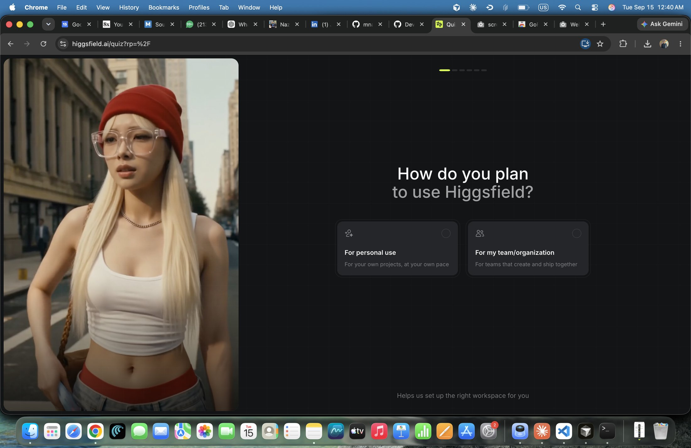</a> <a href="recon/screenshots/11-onboarding-discount-offer-modal.jpg">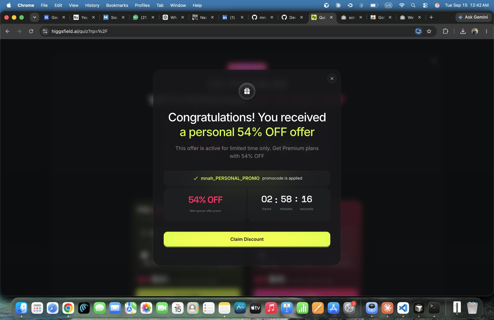</a><br>Also [`01`](recon/screenshots/01-landing-signup-modal.jpg), [`04`–`09`](recon/screenshots/), [`10`](recon/screenshots/10-onboarding-academy-modal.jpg), [`20`](recon/screenshots/20-onboarding-premium-offer-modal.jpg), [`12`](recon/screenshots/12-explore-signed-in.jpg) | **No signup, no quiz, no modal.** Press **Start making**, describe an image, press **Make the image**. That first press starts a guest session with 100 credits, and the run lands in your log. An account is optional; it keeps your runs and lets you publish. | *Draft:* The quiz asks what I want before I've seen what the product does. Each step is a chance to leave. The fastest proof that a generator works is a generation. | Taste. |
| **Urgency everywhere.** A countdown in the top bar on every page and inside both paywalls, and a "personal" 54% discount with its own timer and promocode.<br><a href="recon/screenshots/20-onboarding-premium-offer-modal.jpg">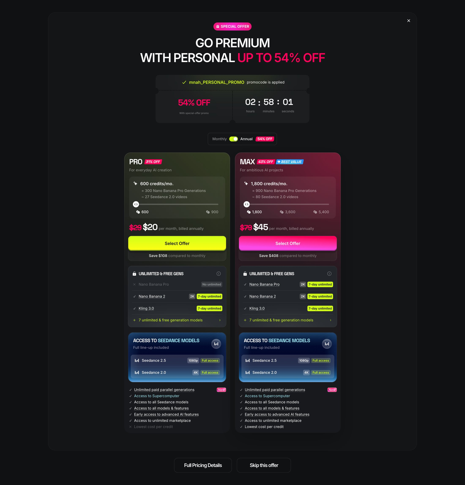</a><br>Also [`11`](recon/screenshots/11-onboarding-discount-offer-modal.jpg), [`22` (PDF)](recon/22-explore-signed-in-full-capture.pdf) | **No timers and no discounts.** The price on the button is the price, with no struck-through "original". The limits are stated plainly where you make things: "N free images left today on this deployment, of 57", and the plan cards state their daily caps. | *Draft:* A countdown that follows you across every page tells you the discount is the product. I'd rather you trust the number on the button, and you can't do that if it's shown next to a fake original. | Taste. Having no payments made it easy, but I wouldn't add a timer with payments. |
| **34 models across three mega-menus**: 14 image, 15 video, 5 audio, each with a one-line pitch and `TOP`/`NEW` tags.<br><a href="recon/screenshots/13-nav-megamenu-image.jpg">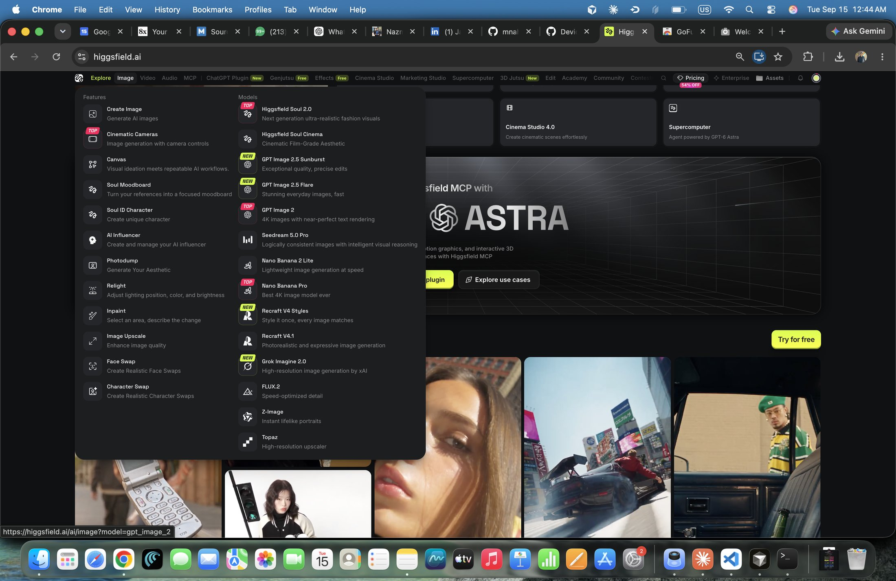</a><br>Also [`14`](recon/screenshots/14-nav-megamenu-video.jpg), [`15`](recon/screenshots/15-nav-megamenu-audio.jpg) | **One image model, FLUX.1 [schnell], with its limits stated on the page:** it makes 1024×1024, and other aspects are a centre crop of that. A second model, FLUX.2 [klein], is in the catalogue but switched off. | *Draft:* A model picker is only useful if the models are really different and you know how. One model whose limits I can state is more honest than a menu I can't back up. | Mostly a constraint: the free Cloudflare allocation, and FLUX.2 [klein] tested badly (14 s per image, a false moderation flag). Stating the limits is taste. |
| **The Generate button is priced for the exact configuration**, before you press it, as a credit cost with the "original" struck through (Image: 8.5 → 6.5; Video: 80 → 45).<br><a href="recon/screenshots/17-create-video-empty-state.jpg">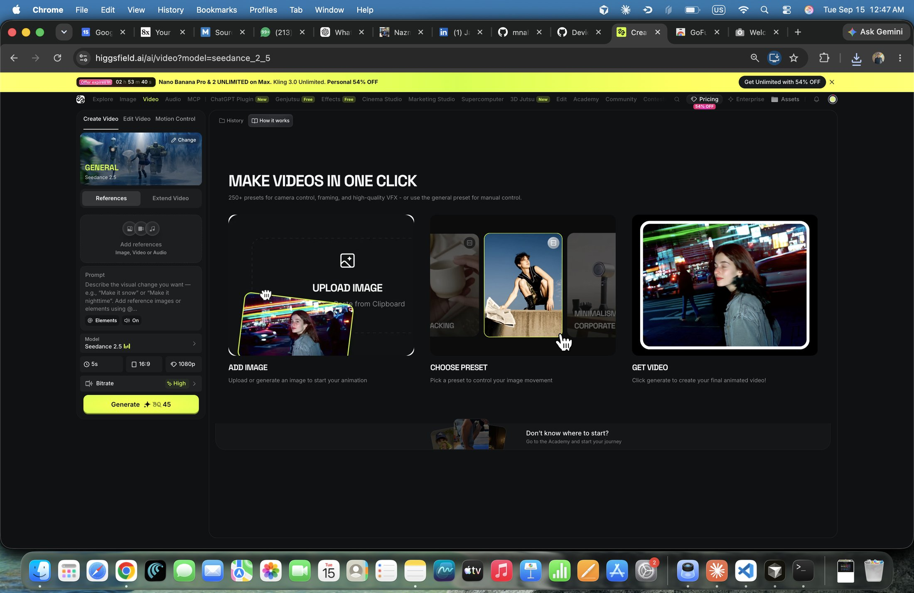</a><br>Also [`16`](recon/screenshots/16-create-image-empty-state.jpg) | **Kept, and made the centre of the design.** The cost meter shows the price and your balance after it, and moves with every option. Pressing **Make** is the commit: the meter drains while the entry prints into the log, the one orchestrated animation in the app. | *Draft:* This is the best idea in the reference. Showing the cost before you commit is what makes credits feel fair, so it's the one thing I made bigger rather than smaller. | Taste. |
| **Plans translate credits into outcomes**: "600 credits = 300 Nano Banana Pro generations, ~27 Seedance 2.0 videos".<br><a href="recon/screenshots/20-onboarding-premium-offer-modal.jpg"></a><br>Also [`23` (PDF)](recon/23-upgrade-plan-credits-modal.pdf) | **Kept, and made to match the real caps.** Each card says what its credits buy and its daily image cap, read from the same database column the server enforces. A test fails if a card promises more than its caps allow. | *Draft:* Outcomes beat abstract credits, but only if you can actually get them. An outcome you can't reach inside the plan's own limits is a quieter version of the countdown. | Taste. The caps themselves come from the free tier. |
| **History and Assets are separate places:** History is a tab beside each create surface; Assets is its own item in the header.<br><a href="recon/screenshots/17-create-video-empty-state.jpg"></a><br>Also [`22` (PDF)](recon/22-explore-signed-in-full-capture.pdf). The Assets page itself was never opened in recon. | **One log is both the library and the ledger.** Every run is an entry: media first, then the model, what it cost, and any refund. The list view lines up every credit in and out with the balance after it. Every entry has a permanent link. | *Draft:* "What did I make" and "what did it cost" are the same question asked twice. Putting them in one place is also how the backend proves it's real: you can see the charge and the refund next to the image. | Taste (the chosen design direction). |
| **"250+ presets for camera control, framing, and high-quality VFX"**, as ADD IMAGE → CHOOSE PRESET → GET VIDEO.<br><a href="recon/screenshots/17-create-video-empty-state.jpg"></a><br>The preset gallery itself was never opened in recon. | **14 camera moves, each previewed by a real render of itself** over a library still, made by the same renderer that makes yours. | *Draft:* A preset is a promise about what the camera will do. Fourteen I can render honestly beat 250 I can't, and the preview should be the move itself, not an illustration of it. | Both: the count is a compute constraint (every move is a real ffmpeg render); previewing each by its own render is taste. |
| **A community feed of other people's generations** on the landing page: "Explore the inside of every project", cards with an author and a `Public` badge.<br>[`19` (PDF)](recon/19-landing-page-full-capture.pdf) | **An opt-in public log.** Everything is private by default. Only registered accounts can publish, guests never can, and the rest of the public log is the labelled seed library. | *Draft:* With open guest access, showing everyone's prompts on the home page is a privacy problem and a moderation problem. Publishing should be a choice you make, run by run. | Taste. With no moderation, it's also the only safe option. |
| **Soul ID, AI video and studios**: Soul ID Character in the Image menu; 15 video models including Seedance, Kling, Sora and Veo; Cinema, Marketing, Shorts and Faceless studios.<br><a href="recon/screenshots/14-nav-megamenu-video.jpg">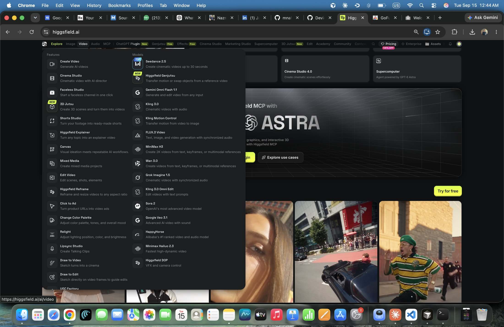</a><br>Also [`13`](recon/screenshots/13-nav-megamenu-image.jpg) | **Cut.** See [Not in Docket, and why](#not-in-docket-and-why). | *Draft:*<br>• **Soul ID** needs identity-conditioned generation, and FLUX.1 [schnell] is text-to-image only, so shipping it would claim a consistency the model never produced.<br>• **AI video:** there's no free, fast, reliable image-to-video API, so the camera moves are real renders instead, labelled as such.<br>• **Studios** were cut in the first brief to keep the loop small. | Constraint: the model, the free tier, and scope. |

## What's real

- **Every screen reads from Postgres through the API.**
  - Every update after a page loads goes through the JSON endpoints under `/api` (`/api/log`, `/api/jobs`, `/api/plans`), or the sign-in server actions.
  - A page's first render uses the same server-side read models those endpoints call (`src/lib/log/entries.ts`, `src/lib/docket/make-data.ts`, `src/lib/billing/plans.ts`).
  - Every run, image, video, price, plan, balance and count on screen comes from the database. No screen shows hardcoded content, mock data or a canned response in its place; the [backend audit](#the-backend-audit) went looking for them. The one page with example values is `/style`, the design system, which isn't part of the product.
- **Images are generated by FLUX.1 [schnell] on Cloudflare Workers AI,** from your prompt, when you press the button.
  - The model makes 1024×1024 images; other aspects are a centre crop of that, and the make box says so.
- **Video is a real ffmpeg render.** A camera move is rendered frame by frame over a real still into an MP4. It's not diffusion and not AI-generated video.
- **Pre-rendered examples are real renders too,** made by the same renderer ahead of time. They're stored as assets in the database, labelled, and never charged.
- **Nothing is mocked.**
  - When image generation fails, the run says why and is refunded. No stand-in image is ever shown in place of one the model didn't make.
  - Library images are labelled "From the library".
  - Payments are a labelled demo.
  - Tests use a fixture image provider that can only be switched on off Vercel, so it can never run in production.

| What you see | What it is | How it's labelled |
|---|---|---|
| An image | FLUX.1 [schnell] output for your prompt | "Generated by FLUX.1 [schnell]" |
| A camera move | ffmpeg render over the still you chose | "Rendered with ffmpeg", compared against "Still" |
| A pre-rendered example | the same move, rendered earlier over a library still; free | "Pre-rendered example", compared against "Library still", with why it was served and "Nothing was charged" |
| A library image | FLUX.1 [schnell] output made for the public library | "From the library" |
| A refunded run | a failure or a stop, with the reason | "+2 refunded", never colour alone |
| Checkout | no payment processor | "Demo checkout, no real payment" |

### Why video is a camera move, not diffusion

The product sells direction: choose how the camera moves over an image. No free image-to-video diffusion API could run inside this budget: they're paid, slow, rate-limited and unpredictable. Returning someone else's clip and calling it generated would break the one rule this build never bends: **a real transform, or a label.**

What *can* be real is the direction itself. `src/lib/render/camera.ts` renders 14 moves as real ffmpeg filter graphs:
- push-in, crash zoom, pull-out, pan, tilt
- arc (a 2D pan plus roll, rendered oversize so the rotation never shows corners)
- handheld drift
- rack focus (a blurred layer faded over the sharp frame)

---

## Design

### The directions I was offered

When 8x changed the brief, I asked for three genuinely different directions: different layouts and information architecture, not three palettes of one layout. One had to come from the product's own vocabulary (shots, takes, contact sheets), and one from my direction. Nothing of the reference's identity could survive, and none of the patterns that mark a design as generated. They're kept in full, with palettes, type and wireframes, in [`docs/design-directions.md`](docs/design-directions.md).

| | The idea | Its one memorable thing | Outcome |
|---|---|---|---|
| **1. Contact sheet** | A photographer's bench: you expose a frame, print takes of camera moves over it, and everything reads as a numbered contact sheet | A film strip along the bottom that is the navigation, history and progress at once | Not chosen |
| **2. The run log** | Every generation is a run with a receipt, and the app is that log, read downward with the media inside the entries | The commit: the cost meter drains while the entry writes itself into the log | **Chosen, as Docket** |
| **3. Diptych** | One full-bleed stage holding a still and its camera move, with a divider you drag; everything else in drawers | The handle | Not chosen; **the handle was taken into Docket** |

### What I chose, and why

In my words, as I gave the decision:

> I'm choosing Direction 2, the run log. Name: Docket.
>
> Why: 8x told me the backend has to be real and connected. Direction 2 is the only one where the real data *is* the interface. Every generation shows what model ran, what it cost, and whether it was refunded, so the honesty of the backend is something you can see, not something I have to claim in a README. It also uses plain words — "make the image", "credits" — where Direction 1 asks a first-time visitor to learn "expose" and "stock", and Direction 3 hides everything in drawers a reviewer can't link to or screenshot.

### What I took from Direction 3

> The handle. When a camera move finishes, its log entry shows the still and the moving take side by side with a divider you drag to compare them. That's the clearest way to explain what this product does, and it gives Direction 2 a creative moment it otherwise lacks. It's user-dragged only — no automatic sweep. The commit stays the one orchestrated animation.

Building it exposed a data question. A pre-rendered example was rendered over a library still, not over the image you picked, so comparing it against your image would mislead. Every video asset now records the still it was actually rendered over (`assets.source_asset_id`), and an example compares against a "Library still".

### The changes I asked for, and why

| I asked for | Why | How it's built |
|---|---|---|
| **The media leads, the receipt supports** | My worry with a log is that it reads like an admin panel | In every entry the image or video is the largest thing; model, aspect, timing and cost are a quiet line beneath. The media view is the default, and the list view is the toggle. |
| **Credits in and out can't depend on red and green alone** | It's the one distinction the design rests on, and it's unreadable for red-green colour-blind users | Every amount carries a sign and a word: "−2 charged", "+2 refunded", "+600 added", "0 free". The meter's cost segment is hatched. Colour only reinforces. |
| **The public log is opt-in** | Other people's prompts on the home page is a privacy problem, and with open guest access a moderation problem | The public log is the seed library plus runs someone chose to publish. Everything is private by default, only registered accounts can publish, and guest runs are never public. So that moves show up there too, a library account that can't be signed in to published four pre-rendered camera-move runs (`scripts/seed-public-moves.ts`). They're real runs, labelled pre-rendered examples like anyone's. |
| **Every entry gets a permanent link** | A log you can't link into isn't a record | `/log/<id>`: the owner sees everything, including their balance after the run. Anyone else sees it only if it's published. A private run and a missing one get the same 404. A shared link previews as the run itself: its title, what it was, and a card made from its image (a camera move's poster frame). Private runs get no preview and are marked noindex. Titles are cut at a word, with an ellipsis. |
| **My tell-check missed two things** | The wireframes still had all-caps labels, and a mono face for small labels is itself a tell | Sentence case throughout, preset names included ("Slow push-in", not "Slow Push In"; `verify-log` fails on a Title Case preset). Public Sans's tabular figures measured a **0.00px** spread across digits, so the monospaced face was dropped entirely. |
| **A new visitor's empty log is an invitation** | A blank page is a dead end | First visit: one line saying what the log will hold, the make box, and the public log beneath it. |
| **Stay on the free tier, cap each visitor at 5 images a day, and show the real count** | So no one drains the day for everyone, "since showing the real numbers is the whole point of Docket" | See [Limits](#limits-compute-and-image-quota). `/make` shows "N free images left today on this deployment, of 57"; home states the limits under Free to start. |
| **Home needs a headline, must not lead with a refusal, and must show the differentiator** | Home had no headline naming Docket, and on a day with no images left its first sentence was a refusal; the handle appeared nowhere until someone finished a render | A one-line h1, "Docket makes an image, then moves the camera over it.", in the first HTML, with no loading skeleton ahead of it. Under it sits a real still-and-take pair from the database, with the handle. When today's images are gone, "Move the camera over a library image" is the primary action and the quota note comes second. |
| **Home explains; /make does; /log remembers** | Home mixed the pitch, the make box and the public log, so a first-time visitor had to work out what Docket is from a feed | Home is now, top to bottom: the headline and one sentence on who it's for; the real pair; how it works in three steps, each a real artifact from one published run (its still, its move, its receipt line); what's real in three lines, one linked to a real record; free to start, read from the enforced values; one primary action, **Start making**; and a strip of four public entries. The make box lives on `/make` only. The whole public log is at `/log?scope=public`, paged in a stable order. No stats, testimonials or feature grid, and every number on the page is read from the database or the enforced limits. |
| **An account menu, top right** | The balance chip was a link to /credits and nothing else: no way to see who you are, reach your log or sign out from anywhere | With a session, the balance is a menu button showing who you are (the email, or Guest), Balance (→ /credits), Your log and Sign out. It's a WAI-ARIA menu button: aria-expanded, arrow keys with Home and End, Escape returns focus, a click outside closes, 40px items, and it fits at 390px. A guest's account exists only in their browser's cookie, so a guest's menu leads with **Create an account to keep your runs**, and a guest's sign-out asks first and says that every run becomes unreachable for good. A registered account signs out at once. Both land on home. Signed out, it's **Sign in**, as before. |
| **Plan cards and starter copy must tell the truth about limits; let paid plans raise the daily image cap, not live renders** | "In a product built on honest numbers, this is the worst contradiction in the app" | Each plan's images-a-day is a database column that both the cap and the cards read; every card and the starter state the daily images and the live-move cap beside the credits; a verify script keeps them from drifting. |
| **Switch over before the README** | Anyone opening the live link was still landing on the clone, "which is exactly what 8x said they no longer want. That's the biggest risk in the project." | Docket became `/`, the clone was deleted, every old URL redirects, and the readiness check was re-run against production. |

### The one memorable thing

**The commit.** When you press Make the image or Render the move, the hatched cost segment of the meter drains while the new entry prints itself into the top of your log, top to bottom, at the exact aspect it will fill. It's the only orchestrated animation in the product. It answers the action and shows what the action cost. With reduced motion on, it doesn't play.

### Type, colour and the rest

- **Type:** one typeface, Public Sans, drawn for government forms: plain, legible small, and right next to a number. It's self-hosted, with four sizes and a label, and weight carries the hierarchy, not capitals.
- **Colour:** eight colours named for what they mean in a record: paper, field, line, ink, muted, posted, charged, live. Every text colour is at least 5.1:1 on both backgrounds.
- **Everything else:**
  - Visible keyboard focus everywhere.
  - Reduced motion respected.
  - 16px inputs on phones, so iOS never zooms.
  - Tap targets of at least 32px.
  - Skeletons shaped like what they stand in for.
  - Errors that say what happened and what to do next.
- Every component, in every state, is on `/style` (not linked from the product). `scripts/dev/design-system-check.mjs` audits it.

---

## History: from a clone to Docket

**The first brief** (14–15 September 2026) asked for a working rebuild of higgsfield.ai's core loop. I built it in 21 PRs:
- a dark interface with the reference's lime accent
- an Explore page of section grids
- separate image and video studios
- an Assets library
- a paywall

The backend was real from the first PR: Postgres, a credit ledger, an async job pipeline, FLUX.1 [schnell] images, and ffmpeg camera moves.

**Then 8x changed the brief** (25 September): *"Keep your idea and your backend, and rebuild the frontend with your own layout and visual design. The backend has to be real and connected: a working database and API, not mock data or hardcoded responses."* So it stopped being a clone. The work since then is PRs #22–#29.

**What changed**
- **The whole frontend.** Docket was designed from the three directions above and built alongside the old UI so the live link never broke. It became `/` in PR #29.
  - The clone was deleted, not hidden.
  - Every one of its URLs redirects to the Docket page that does the same job: `/ai/image` to `/make`, `/ai/video` to camera-move mode (keeping `?preset=` and `?image=`), `/assets` to `/log`, `/pricing` to `/credits`, and `/login` and `/signup` to `/sign-in` and `/sign-up`.
  - No trace of the reference's identity is left in the running app: its name, copy, colours, layout, nav and product names are all gone. Even the plan taglines, copied into the seed data from the recon, were rewritten.
- **The backend audit** (below), before any UI work.
- **New backend pieces the design needed,** each named in its PR:
  - the log read model and `/api/log`
  - opt-in publishing
  - permanent links
  - the still each video was rendered over
  - the shared daily image allowance
  - a proper asset source for pre-rendered examples

**What stayed**
- The schema's core and every Postgres guarantee below.
- The credit ledger.
- The async job pipeline, with charge-on-submit and refund-on-failure.
- Auth, with guest sessions you can claim by creating an account.
- The ffmpeg renderer and its 14 moves.
- The compute caps, the kill switch and the pre-rendered library.
- The demo checkout and `AHSAN345`.
- The 1,500-upload storage cap.
- The workflow: a branch and PR per chunk, merge commits, captured agent logs.

**Before and after** (the same jobs, first as the clone, then as Docket; the "after" screenshots are from production):

| | Before: the clone | After: Docket |
|---|---|---|
| Home | 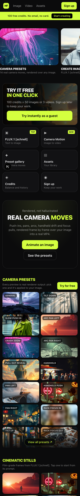 |  |
| Making an image | 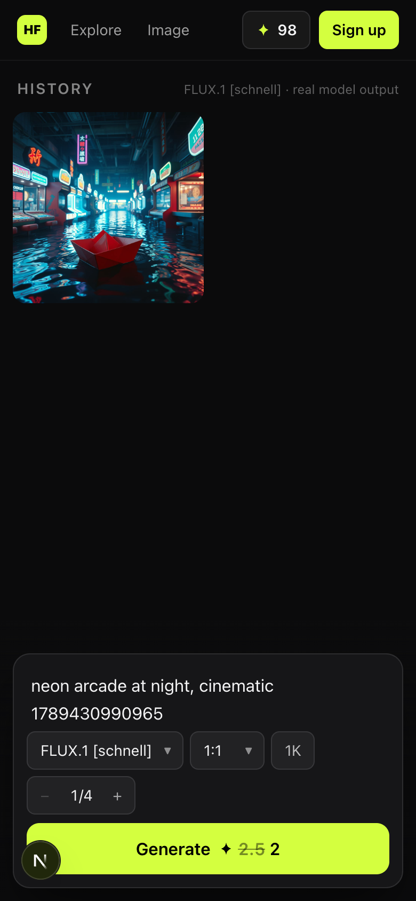 | 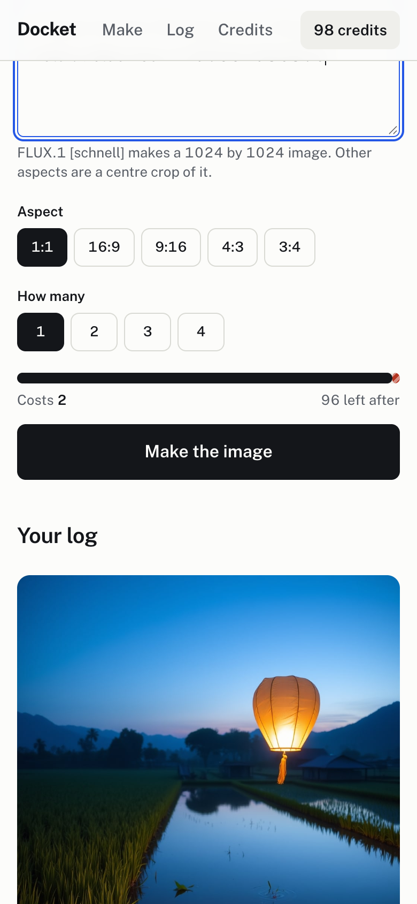 |
| A camera move | 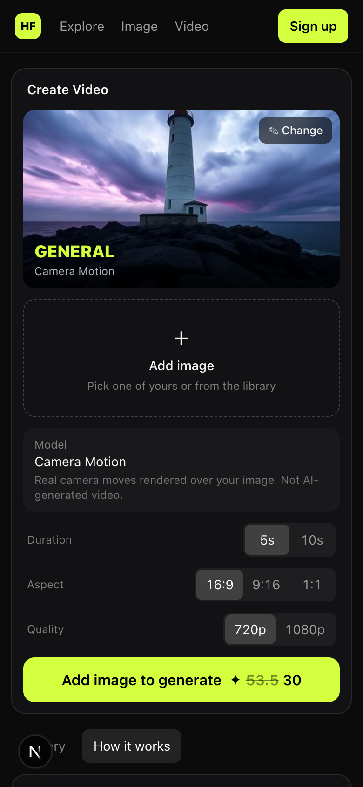 | 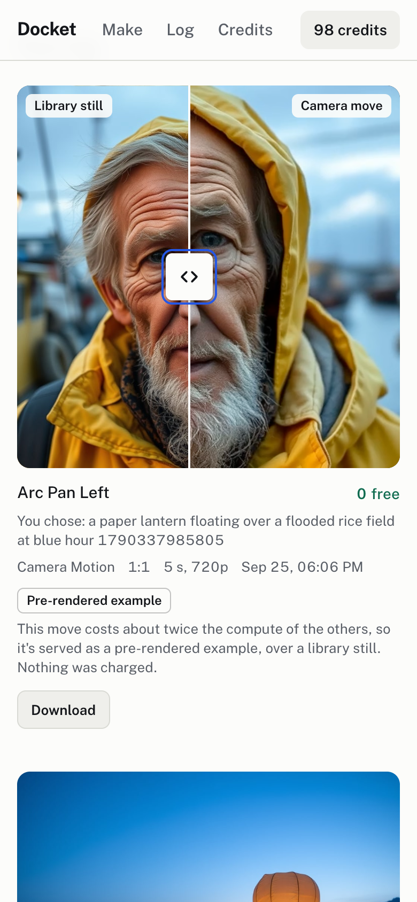 |
| Checkout | 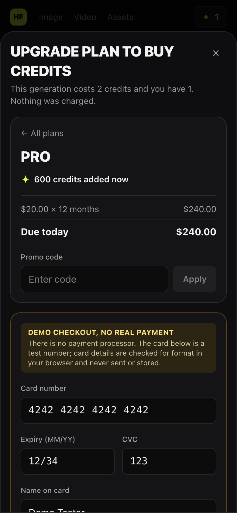 | 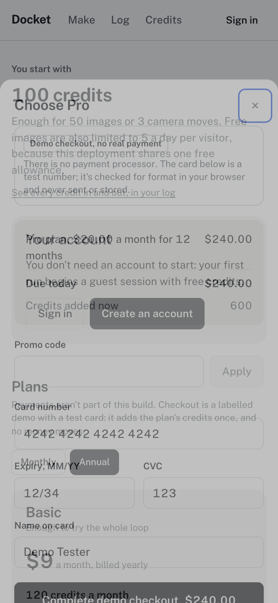 |

| Desktop, before | Desktop, after |
|---|---|
| 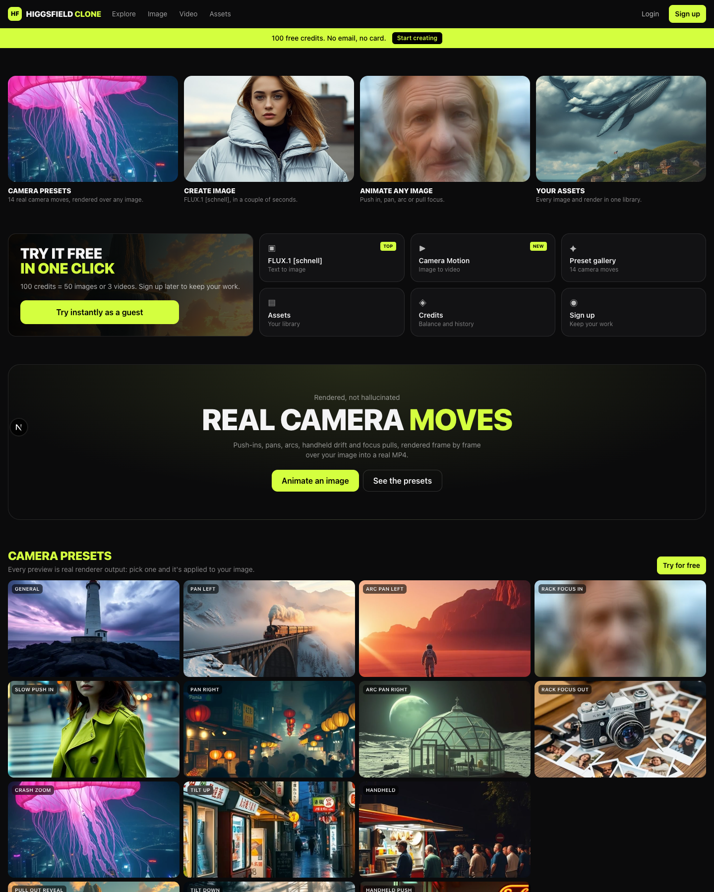 | 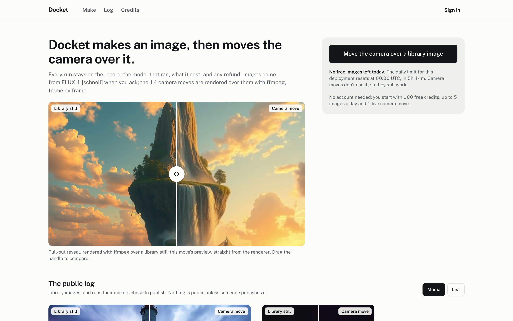 |

The recon of the reference product is kept in [`recon/`](recon) as history.

---

## The backend audit

Before any Docket UI was built (PR #22), I audited the app for anything a reviewer could reasonably read as mock or hardcoded. Here's what was found, and what changed because of it:

| What could read as mock or hardcoded | Where it lived | What changed |
|---|---|---|
| **An image stand-in:** when the image provider's quota ran out, a library image was attached to the failed run as a labelled "sample" | the job runner | **Removed.** The run fails, is refunded, and says: "The free daily image limit for this deployment has been used up. It resets at 00:00 UTC, in 11h 32m. Your credits were refunded." |
| **Identity encoded in file names:** seed images found by `url LIKE '/media/seed/cinema-%'`, pre-rendered clips by `…library-<preset>-<aspect>-…` | home, examples, video jobs | Real columns (`assets.collection`, `topic`, `aspect`), backfilled; every lookup is by column |
| **A promo code in a map in the source** | billing | A `promo_codes` table, seeded; `AHSAN345` works exactly as before |
| **No publish model:** "public" was implicit | none | `generation_jobs.published_at`: opt-in, registered accounts only |
| **Nothing to read a run from** | none | A log read model (job + outputs + ledger in one entry, with charged, refunded or free), served by `GET /api/log`, `GET /api/log/<id>`, `POST /api/log/<id>/publish` and `DELETE /api/log/<id>` |
| **Numbers typed into copy** ("100 free credits", "100 credits = N images") | Explore, auth | Derived from the one starter-credit constant and database prices |
| **Hardcoded preset categories** | the preset gallery | Derived from `presets.category` |
| **An editorial landing page** (section titles, hero cards, poster titles in a component) | Explore | Not moved into the database: Docket has no editorial sections. Home explains Docket from real rows (one published run, the public log), and the old page was deleted at switch-over. |
| **`sample` as the source of pre-rendered examples** | the schema | A proper `prerendered` source at switch-over, once no old UI read `sample` |

Checked and left alone:
- The seed catalogue: it's only used to seed the database and is never imported at runtime.
- Prices and plans: they're read from the database.
- The render caps and the test card.

---

## Limits: compute and image quota

This runs on free tiers, and both limits are shown to the people they affect.

### Compute: Vercel Hobby

Every live render is real CPU in a Vercel Function. During the first build, renders used up the Hobby **Fluid Active CPU** allowance (6h 51m of 4h), and deploys started failing. We stayed on Hobby, made rendering cheaper, and put a ceiling on it:
- **The renderer is about 52% cheaper.** I dropped a redundant 2× upscale inside ffmpeg and switched to x264 `superfast`/CRF 23. A push-in went from 1.66 to 0.80 CPU-seconds.
- **Live renders are 720p and 5 seconds,** set in the model's capabilities in the database.
- **Live renders are capped:** 1 per guest, 3 per registered account. The check runs inside the job's transaction with the user row locked.
- **Arcs and rack focus are pre-rendered only.** They cost about twice the others.
- **A 42-clip pre-rendered library covers the rest:** 14 moves × 3 aspects, rendered on a laptop, not on Vercel. Past the cap you get the matching clip, free and labelled, and the button says so before you press it.
- **A kill switch without a deploy:** `npx tsx --conditions react-server scripts/ops/render-mode.ts prerendered` switches every request to examples within about 10 seconds.

Measured CPU-seconds per 720p, 5-second render (local, user+sys; `scripts/dev/measure-render-cpu.ts`):

| move | CPU-s | move | CPU-s |
|---|---|---|---|
| general | 0.79 | handheld | 0.80 |
| slow push-in | 0.80 | handheld push | 0.84 |
| crash zoom | 0.84 | pan left / right | 0.73 / 0.74 |
| pull-out reveal | 0.84 | tilt up / down | 0.76 / 0.77 |
| **arc pan left / right** | **1.61 / 1.58** | **rack focus in / out** | **1.29 / 1.30** |

### Image quota: Cloudflare Workers AI free allocation

- **The free allocation is 10,000 neurons a day.** FLUX.1 [schnell] at 1024×1024 and 4 steps (already the minimum) costs **172.8 neurons**: 4 tiles × 4.8, plus 4 tiles × 4 steps × 9.6. That's **57 images a day**.
- **The measurement agrees:** storage holds exactly 58 generations from the day the allocation first ran out, before the first refusal.
- **How it's shared:**
  - **Site-wide:** `image_usage` counts real provider calls per UTC day, with `CHECK (calls BETWEEN 0 AND 57)`. Every call reserves first. If Cloudflare says the allocation is gone before our count does, the day is marked used up.
  - **Per visitor, by plan:** 5 images a day on the free plan; a paid plan raises it (Basic 10, Pro 15, Max 20), always within the shared 57. The number lives in one place, `plans.images_per_day`: the cap enforces it, and every plan card, the starter copy and the make box read it. `scripts/verify-limits.ts` checks, plan by plan, that the card's number is the one the server refuses at, and that no limit is typed into the UI as a literal.
  - **Per network:** the highest plan cap (20) per IP address, stored only as a keyed hash. This stops new guest sessions from getting around the free cap, while someone alone on their network always gets their plan's full cap.
  - **Live camera moves don't grow with a plan:** 1 in a guest session, 3 per account, on every plan. Rendering is server CPU, which paying doesn't add. Every plan card says so beside the credits.
  - All of it is checked before anything is charged, so a refused request costs nothing and says when the limit resets.
- **Shown, not hidden:** the make box reads "12 free images left today on this deployment, of 57. You can make 5 more". When they run out, it says so and points you to camera moves, which don't use the allowance.
- **Tests never spend it.** An earlier round of UI tests used up a whole day's allocation, including production's share. Now `IMAGE_PROVIDER=fixture` (honoured only off Vercel) swaps in a test double that returns a library image, and records its runs as fixtures.

---

## Postgres guarantees

The money-like parts are enforced by the database, not by application convention:

- **Balance floor.** `CHECK (credit_balance_tenths >= 0)` on users and `CHECK (balance_after_tenths >= 0)` on ledger rows.
  - A charge is a conditional `UPDATE … WHERE balance >= cost`, so two submits racing for the last credits can't both pass, and the `CHECK` backs that up.
  - Credits are integer tenths, so there's no float drift.
- **One charge, one refund per run.** A partial unique index on `credit_ledger (job_id, reason)` allows at most one `generation_charge` and one `generation_refund` per job.
  - Refunds use `INSERT … ON CONFLICT DO NOTHING`, and the balance moves only if the row went in. The worker, a Cancel and the stale-run sweep can all refund at once, and exactly one wins.
  - Status changes are guarded (`UPDATE … WHERE status IN (…)`), so a finished run can't be failed afterwards.
  - The ledger always sums to the balance; the verify scripts assert it.
- **The 1,500-upload cap.** Vercel Blob on Hobby includes 2,000 uploads a month and locks the store for 30 days past that.
  - Every upload first increments `blob_usage`, which has `CHECK (puts BETWEEN 0 AND 1500)`.
  - All storage access goes through one module, and ESLint forbids importing the storage SDK anywhere else.
- **57 images a day.** The `image_usage` counter's `CHECK` makes the free allocation's ceiling a database guarantee, not a hope, and `plans.images_per_day` has a `CHECK` that no plan can promise more than it.
- **Plan credits once per plan.** Grants happen under a `SELECT … FOR UPDATE` on the user row and check for an earlier grant for that plan. Pro → Basic → Pro can't mint credits, even with the promo code or concurrent submits.

---

## Where the first answer was wrong

**In the first build:**
- **Turbopack couldn't bundle ffmpeg.** The installer picks its platform binary with a dynamic `require`, so the render route failed to build. It's now a server-external package, with the Linux binary traced into the functions, and a real render was verified on Vercel before any UI used it.
- **Arc pans showed black corners.** Rotating a frame the size of the output exposes its corners mid-roll. Fixed by rendering 10% oversize, rotating, then cropping.
- **Rack focus was 4–7× slower than the other moves.** A per-pixel blend was replaced with a blurred layer and an alpha fade: 58s → 23s.
- **The demo plan switch minted credits.** Pro → Basic → Pro granted 600 credits every round. Fixed with once-per-plan grants under a row lock.
- **The guest limit was too low for a shared office IP.** 5 guest sessions per IP per hour would have locked out reviewers behind one office NAT. It's 30 now, and configurable.
- **The Vercel project looked for a `public` output folder,** because it was imported with the wrong framework preset. The framework is now pinned in `vercel.json`.
- **The first render settings ran through the Hobby CPU allowance.** See [Compute](#compute-vercel-hobby).

**In the redesign:**
- **The image stand-in.** It was labelled, but it still returned an image the model didn't make for your prompt, which is exactly what the new brief ruled out. It's gone.
- **My tests spent the shared image quota.** A day of UI test runs used up the free allocation that production shares. Tests now use the fixture provider only.
- **The plan cards promised what the limits made impossible.** Pro said "300 images or 20 camera moves" while images were capped at 5 a day on every plan and live renders at 3 per account; the starter said "50 images or 3 camera moves" to a guest who could make 5 images that day and 1 live render. Found by testing the live site cold. Paid plans now raise the daily image cap, the cards state every limit beside the credits, the camera-move outcome is gone (credits can't buy moves beyond the live cap), and a verify script ties the copy to the enforced values.
- **A 10-second database connect timeout was too tight.** Measured connects from a laptop on a bad day took 5 to 20 seconds, and a Neon cold start takes several; slow but healthy connections became errors. It's 30 seconds.
- **The first capacity estimate was 3× too high.** Reading Cloudflare's price sheet as a flat per-step charge gave about 173 images a day. The measured 58 showed the step charge applies per tile, which gives 57.
- **A private run's permanent link returned HTTP 200 twice.** Nothing leaked, since the page said "not found", but a loading skeleton let the response start streaming before the 404 could be set. It happened first under `/log`, then again when home moved to `/`. Both pages now keep their loading states in their own route groups.
- **The public log API revealed publishers' balances.** The permalink page hid a run's "balance after" from strangers, but `/api/log?scope=public` didn't. Only the owner's copy of a run carries it now, and a verify script asserts it.
- **A finished run could flicker back to "running".** Overlapping log refreshes applied an older response after a newer one, briefly showing a Cancel button that then failed. Only the newest response is applied now.
- **Choosing a second plan could close its checkout.** The browser queues a dialog's close event, so the one from closing the first sheet arrived after the second opened.
- **Postgres won't use a new enum value inside the transaction that adds it,** and the migration tool applies migrations in one transaction. The new value is now added idempotently and committed on its own first.
- **The database pool had no error listener.** An idle connection dropping was an uncaught exception that can take the process down. It's logged and discarded now.
- **The seed data kept the reference's wording** (the plan taglines) after the switch to Docket. It was rewritten.
- **My first design draft reached for defaults:** cream, serif and rust for Direction 1, and a dark stage with one hot accent for Direction 3. I caught those; you caught the all-caps labels.

---

## Not in Docket, and why

| Not here | Why |
|---|---|
| Character consistency (the reference's "Soul ID") | It needs identity-conditioned generation. FLUX.1 [schnell] here is text-to-image only, so shipping it would mean claiming a consistency the model never produced. |
| Diffusion image-to-video | No free, fast, reliable API. The camera moves are real renders instead, labelled as such. |
| True orbit and dolly zoom | They need depth information. Arcs are a labelled 2D arc. |
| Uploading your own image | The still picker uses your images and the library. That keeps the upload cap meaningful and avoids moderating arbitrary uploads. |
| Real payments, password reset, email verification, OAuth | See Payments. The rest need email delivery; email and password plus claimable guest sessions cover the loop. |
| FLUX.2 [klein] | Tested live: 14 seconds per image and a false moderation flag on a harmless prompt. It's in the catalogue, inactive. |

## Payments: there are none

**No real payment processing exists in this build.**
- The checkout's card fields (number, expiry, CVC, name) are checked for format in your browser and discarded.
- They have no `name` attribute, appear in no request, and are never stored. The credits e2e records every request the page makes and fails if any carries card details.
- Only the plan id and the promo code reach the server.
- Completing checkout switches your plan and adds that plan's monthly credits once, as a `demo_topup` ledger row noted "no payment taken".
- `AHSAN345` (case-insensitive) takes 100% off; any other code is refused.

---

## Stack

- **Next.js 16** (App Router, Turbopack), TypeScript, Tailwind CSS v4, on **Vercel Hobby** (Fluid compute, 300s functions)
- **Neon Postgres** with Drizzle ORM: schema in `src/db/schema.ts`, migrations in `drizzle/`
- **Vercel Blob** (a private store) behind `/media/[...path]`, with HTTP Range for Safari video
- **Cloudflare Workers AI**: FLUX.1 [schnell]
- **ffmpeg** and **sharp** inside Vercel Functions
- Auth: scrypt password hashes and an HS256 session cookie; guest sessions are real accounts you can claim

## Map of the code

| Path | What |
|---|---|
| `src/app/` | Pages: `/` (in `(home)`), `/make`, `/log` and `/log?scope=public` (in `log/(list)`), `/log/[id]`, `/credits`, `/sign-in`, `/sign-up`, `/style`; the API under `/api`; media under `/media` |
| `src/components/docket/` | Docket's screens: `make/`, `log/`, `home/`, `credits/`, `auth/`, the header, and `routes.ts` (every link goes through it) |
| `src/components/ui/`, `src/components/media/` | The design system: button, field, segmented, amount, tag, cost meter, sheet, compare; media that shows a skeleton until its first frame |
| `src/lib/log/entries.ts` | The log read model: runs with their outputs, stills and ledger movements; privacy rules |
| `src/lib/jobs/` | The run pipeline (submit, charge, run, fail, cancel, retry, refund, sweep), video runs, and `image-quota.ts` |
| `src/lib/render/` | `camera.ts` (the ffmpeg moves), `budget.ts` (fail and refund before the time limit), `policy.ts` (live caps, kill switch) |
| `src/lib/credits/`, `src/lib/billing/` | Pricing shared by UI and server; the ledger; plans, promo codes, card-format checks |
| `src/lib/storage.ts` | The only storage importer; upload reservation against the cap |

## Running locally

```bash
npm install
```

```bash
vercel env pull .env.local
```

```bash
npx drizzle-kit migrate && npm run db:seed
```

```bash
npm run dev
```

The variables are listed in `.env.example`. Values live in `.env.local` (gitignored) and in Vercel.

On a fresh database, `drizzle-kit migrate` can stop at migration 0005: Postgres won't use a new enum value inside the transaction that adds it. Run it a second time.

Seed content:
- `scripts/seed-library.ts`: 68 library images
- `scripts/seed-preset-previews.ts`: 14 move previews
- `scripts/seed-render-library.ts`: 42 pre-rendered examples

## Verification

These run against the real database and storage, clean up after themselves, and never spend the image quota.

- **Database:** `npx tsx --conditions react-server scripts/verify-{auth,ledger,jobs,plans,video,log,limits}.ts` (128 checks)
  - races and exactly-once refunds
  - the daily allowance
  - the render policy and kill switch
  - the plan and promo guards
  - that every stated limit is the enforced one
  - the log's privacy rules
- **UI:** start the app with `IMAGE_PROVIDER=fixture npx next start -p 3100`, then run `node scripts/dev/ui-{make,log,home,credits,menu}-e2e.mjs http://localhost:3100 [screenshotDir] [--mobile]`. It's headless Chrome as a stranger, at 390px and 1440px.
  - `ui-home-e2e` and `ui-menu-e2e` also run against production: home read-only, against the live allowance; the menu creates a guest and a test account and deletes them.
- **Design system:** `node scripts/dev/design-system-check.mjs <baseUrl> [dir] [--mobile]` checks `/style` for contrast, focus, tap targets, reduced motion and the handle's keyboard control.
- **Readiness:** `node scripts/dev/readiness.mjs <baseUrl> [dir]` arrives cold, like a reviewer: a fresh browser, no cookies, signed out, at 390px and 1440px.
  - It checks every page, a real 404, every old URL's redirect, no trace of the old identity, tap targets and 16px controls, the real allowance, and that browsing creates no session.
  - It checks the share previews of home, a published move and the longest-prompt library image (og:title, og:description, a 1200×630 og:image that loads, twitter:card), and that a long title is cut at a word.
  - It makes nothing, so it's safe to point at production. The last run against production (2026-09-26, at the feature freeze) passed 76/76, alongside the home e2e (read-only, 23/23 at each width) and the menu e2e's guest part (20/20 at each width).

## How it was built

- One branch per chunk and a PR for each: what, why this now, what's deliberately not in it, how to verify, and screenshots at 390px and 1440px. PRs are merged with a merge commit.
- `STATUS.md` was rewritten at the end of every branch.
- The walkthrough video follows [`docs/walkthrough.md`](docs/walkthrough.md): a 4:30 beat sheet with the exact lines said to camera.
- Every prompt and final response of the AI-assisted build is captured by hooks into [`.agent-logs/`](.agent-logs) and committed with the code. That includes the design directions as offered and my decisions as I gave them.
